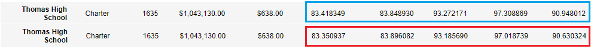

# School District Analysis
## Project Overview
After submitting a complete analysis of the school district's data, the school board has discovered evidence of academic dishonesty. An outside analysis of the *students_complete.csv* file has revealed evidence of altered reading and math grades for ninth graders attending **Thomas High School**. The school board is required to uphold state-testing standards, although the full extent of the academic dishonesty is not known. To conduct an unaltered analyis of the data, a requirement has been identified to *replace all reading and math scores of the **Thomas High School ninth graders** with null values* while keeping the rest of the uneffected school data intact. The following is a report of the school district analysis conducted after adjusting the data set to reflect null values for Thomas High School ninth graders; reporting exactly how these changes affect the overall analysis. 

## Purpose of the Original Analysis
Maria, the chief data scientist for a school district is responsible for preparing all standardized testing data for analysis, reporting, and presenting. Maria is asking for assistance in analyzing student funding and student standardized test scores. We are tasked with aggregating the data provided by the district and showcasing the trends in school performance in order to properly inform the school board; which will make decisions regarding school budgets and priorities. 

**NOTE:** The original analysis of the school district data has been completed as required based on the requirements of the district and can be viewed under the **PyCitySchools.ipynb** branch of the **School_District_Analysis** repository. All code for the corrected analysis, Named: **PyCitySchools_Challenge.ipynb** was refactored from this code. 

## Adjusting the Data Set - Results
- **How is the District Summary affected?**
    - Casting the Thomas High School ninth graders math and reading scores as *'NaN'* changes the district summary in several marked ways. Namely in the back-end calculations that used the total number of students to calculate passing percentages. The number of students whos test values return *'NaN'* needs to be subtracted from the total population in order to return a percentage that does not include students with dishonest test scores. In doing so, the refactored values for *Average Math Score, % Passing Math, % Passing Reading, and % Overall Passing* are observed going down in response to losing a subsect of students whos scores reflected passing grades.

 
 

- **How is the School Summary affected?**
    - The School Summary remains greatly unchanged, save for the row containing Thomas High School. The values for THS averages are adjusted to drop the dishonest values for the ninth grade class. By dropping the dishonest values, the classes that tested according to the state-testing standards *(10th Grade - 12th Grade)* can still be evaluated by the same methods as the rest of the schools. These new averages are calculated and displayed by using a method ***(.loc)*** to locate and replace the dishonest values with the adjusted values leaving the rest of the data frame unchanged. Using this method to replace the tainted values means the data for Thomas High School can still be used to draw conclusions on the school's performance without concern of academic dishonesty. These adjusted averages reveal that *the performance of the 10th-12th Graders remains exceptional in comparison to the rest of the schools evaluated.* The following image shows the original values in blue followed by the adjusted values in red.

 
 

- **How does replacing the ninth graders’ math and reading scores affect Thomas High School’s performance relative to the other schools?**
    - Despite the academic dishonesty, the rest of the students at Thomas High School perform exceptionally well when compared to the rest of the district. After adjusting for the scores of the freshman class, the averages for test scores and passing percentages can be observed dropping by a small fraction of a percentile across the data frame. However, the averages remain very high which attests to the good performance of the school in comparison to the rest of the district (Thomas High School places second overall for % Overall Passing).
- **How does replacing the ninth-grade scores affect the following:**
    - **Math and reading scores by grade?**
        - The scores for the freshman class are non-existent. This is a stark contrast to the previous evaluation in which the freshman class performed best overall for average math scores *(83.6%)* by grade, and roughly middle of the pack for reading scores *(83.7%)* by grade. The values for 10th - 12th remain unchanged. 
    - **Scores by school spending?**
        - The scores by school spending per student displayed by the ***spending_summary_df*** data frame remains the same. The small subsect of students scores that were removed did not cause the averages to change enough to cause a difference in outcomes.***
    - **Scores by school size?**
        - The scores by school size remains unchanged. The medium school bracket displayed in the ***size_summary_df*** data frame is the bracket that contains Thomas High School. The small subsect of students scores that were removed did not cause the averages to change enough to cause a difference in outcomes.***
    - **Scores by school type?**
        - The scores by school type remains unchanged. This is due to the small subsect of students scores removed not causing the averages to change enough to cause a difference in outcomes.***

 
 

*****NOTE:** By adjusting the formatting to display 5 significant figures past the decimal, a change can be observed. However, the current formatting to 1 or 0 significant figures past the decimal does not allow for the change to be viewed.   

 

## Summary of Changes - Updated School District Analysis

 

- The total number of students used to calculate averages for reading scores, math scores, and overall passing percentages in the ***district_summary_df*** has been adjusted to reflect the population minus the freshman class of Thomas High School. These students are not included in these calculations to maintain academic integrity.

- The total number of students passing math and reading, as well as the overall averages of scores and passing percentages change as a result of the students who's scores have been changed to reflect *'NaN'*. This is due to the students' grades not meeting the criteria of the conditional statements that filter out the passing students from the rest of the population.  

- Code has been inserted to execute the specific calculations needed for the remaining Thomas High School student population with regards to the change in population due to the freshman scores being dropped. These changes can be seen in the ***per_school_summary_df*** and allow for the school to still be evaluated by the same metrics. 

- The ***.loc*** function is used on the ***per_school_summary_df*** to insert the above changes without disturbing the rest of the data set. 

- Math and reading scores by grade returns *'NaN'* for Thomas High School freshman in the ***math_scores_by_grade*** and ***reading_scores_by_grade*** data frames. This is due to the students' grades returning 'NaN' for the entirety of the freshman class, resulting in the inability to execute evaluations.  